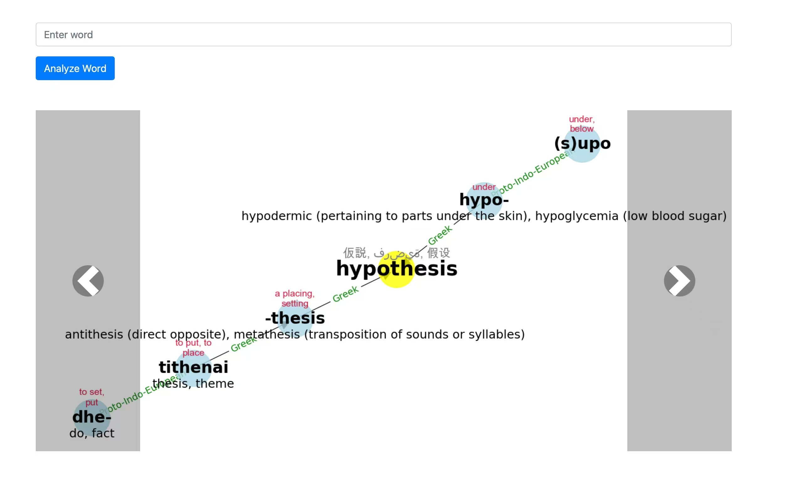

# WordOrigins

A tool for analyzing word etymologies and visualizing them as interactive graphs.



## Overview

WordOrigins is a web application that allows you to explore the etymology (origin and historical development) of words. It provides detailed analysis of how words evolved over time, breaking them down into their component parts and tracing each part's linguistic lineage.

Key features:
- Detailed etymology analysis of any word
- Visual graph representation of word origins
- Support for multiple languages including English, French, Arabic, Japanese, and Chinese
- Interactive web interface for exploration

## How It Works

1. Enter a word you want to analyze
2. The system connects to OpenAI's API to perform deep etymology analysis
3. Results are processed and displayed as an interactive graph
4. Each node in the graph represents a component of the word's etymology
5. You can browse through previously analyzed words

## Installation

### Prerequisites

- Python 3.8+
- OpenAI API key
- Required fonts (included in the repository):
  - Noto Sans CJK Regular
  - Noto Sans Arabic
  - Arial Unicode MS

### Setup

1. Clone the repository:
   ```bash
   git clone https://github.com/lachlanchen/WordOrigins.git
   cd WordOrigins
   ```

2. Install dependencies:
   ```bash
   pip install -r requirements.txt
   ```

3. Set your OpenAI API key as an environment variable:
   ```bash
   export OPENAI_API_KEY=your_api_key_here
   ```

## Usage

### Running the Web Application

Start the Tornado web server:

```bash
python app.py
```

Then open your browser and navigate to `http://localhost:7788`

### API Endpoints

- `GET /word/{word_to_analyze}`: Generates and displays the etymology graph for a word
- `GET /word/next-word`: Navigate to the next word in the list
- `GET /word/prev-word`: Navigate to the previous word in the list
- `GET/POST /get_word_etymology/{word}`: API endpoint to get the etymology data and image

## Components

### WordEtymologyAnalyzer

Connects to OpenAI's API to get detailed etymology information for a given word. Includes caching mechanisms to avoid redundant API calls.

### EtymologyGraph

Creates visual representations of etymology data using NetworkX and Matplotlib.

### Web Application

A Tornado-based web server that handles requests and serves the user interface.

## Technical Details

- The application stores JSON files of analyzed words for caching
- Images are generated as PNG files
- Special font handling is implemented for multilingual support
- The graph layout is calculated based on node depth and relationships

## Dependencies

- tornado: Web server framework
- openai: OpenAI API client
- matplotlib: For generating graphs
- networkx: For graph data structure
- PIL/Pillow: For image processing
- numpy: For numerical operations
- cjkwrap: For handling CJK text wrapping
- json5: For robust JSON parsing

## Roadmap

- Add support for more languages
- Implement user accounts to save favorite etymologies
- Improve graph visualization with zooming and panning
- Add more detailed linguistic information

## License

Apache License 2.0

## Acknowledgements

- OpenAI for providing the linguistic analysis capabilities
- Google Noto fonts for multilingual text support
